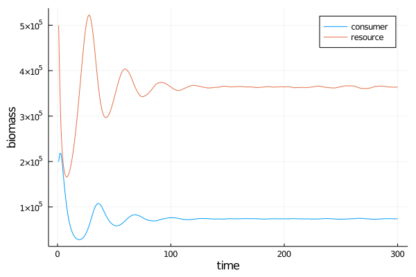
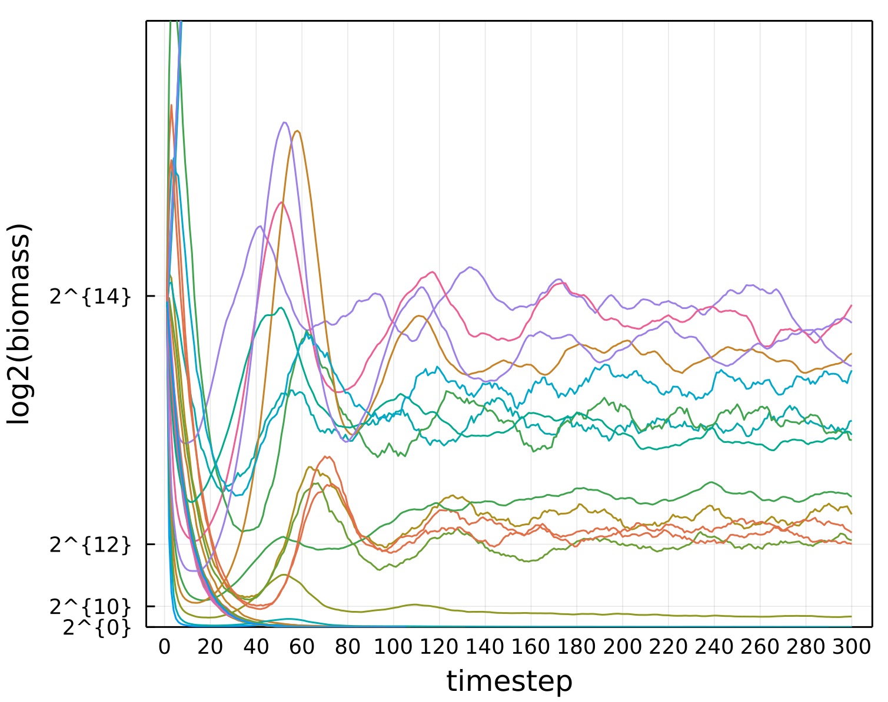

# MetacommunityDynamics.jl

A Julia library for simulating the dynamics of species interaction
networks across space and time. Part of [EcoJulia](http://github.com/EcoJulia),
and built on top of [DynamicGrids](http://github.com/cesaraustralia/DynamicGrids.jl).


This software is designed to simulate how the composition of ecological communities changes over time.


# Examples

## Lotka-Volterra 


The Lotka-Volterra (LV) system is a set of coupled differential equations
which describe a system of consumers and resources (also called predators and prey).

```
using MetacommunityDynamics
using DynamicGrids
using Dispersal: OutwardsDispersal
using Distributions 
consumermodel = 
    Eating{Tuple{:C,:R}}(
        functionalresponse=LotkaVoterra(0.1), 
        dt=0.1) +
    OutwardsDispersal{:C}() + 
    LinearMortality{:C}(0.3);

resourcemodel = 
    LogisticGrowth{:R}(λ=2, K=200., dt=0.1) +
    LinearMortality{:R}(0.01) + 
    OutwardsDispersal{:R}();

model = resourcemodel + consumermodel

gridsize = 100
initconsumer = rand(Biomass, Uniform(10, 30), gridsize, gridsize)
initresource = rand(Biomass, Uniform(10, 90), gridsize, gridsize)

arrayout = ArrayOutput((C=initconsumer, R=initresource ), tspan=1:300)
sim!(arrayout, model)
```

and to plot

```
using Plots

Cs = Float64[]
Rs = Float64[]
for t in arrayout
    push!(Cs, sum(t[:C]))
    push!(Rs, sum(t[:R]))
end

plot(1:length(Cs),Cs, label="consumer")
plot!(1:length(Rs),Rs, label="resource")
xlabel!("time")
ylabel!("biomass")

```



## Food Web

```
using MetacommunityDynamics
using DynamicGrids
using Plots
using Distributions
using Dispersal: Moore, DispersalKernel
using EcologicalNetworks: nichemodel, trophic_level, UnipartiteNetwork

number_of_species = 30
connectance = 0.15

dims = (25,25)

foodweb = nichemodel(number_of_species, connectance)
speciespool = DiscreteUnipartiteSpeciesPool(Symbol.(foodweb.S), Matrix(foodweb.edges)) 
trophicdict = trophic_level(foodweb)  

resourcenames = filter(s -> trophicdict[String(s)] == 1.0, species(speciespool))
consumernames = filter(s -> trophicdict[String(s)] != 1.0, species(speciespool))

masses = Dict()
for (k,v) in zip(keys(trophicdict), values(trophicdict))
    masses[Symbol(k)] = 2^v
end 
masses = NamedTuple(masses)
    
consumermodel = 
    FoodWebEating(consumernames, resourcenames, LotkaVolterra(0.03), speciespool.metaweb) +
    AdjacentBernoulliDispersal(consumernames, DispersalKernel(radius=1), 0.1) +
    LinearMortality(consumernames, 0.01);

plantmodel = 
    LogisticGrowth(resourcenames) +
    AdjacentBernoulliDispersal(resourcenames, DispersalKernel(radius=3), 0.1) + 
    LinearMortality(resourcenames, 0.01);


fullmodel = consumermodel + plantmodel

init = NamedTuple(merge(
    rand(Biomass, resourcenames, Exponential(10), dims...),
    rand(Biomass, consumernames, Exponential(10), dims...)));

arrayout = ArrayOutput(init, tspan=1:1000, aux=(masses=masses, speciespool=speciespool,))
@time sim!(arrayout, fullmodel) 


```





## Contributing

Open a PR or issue
