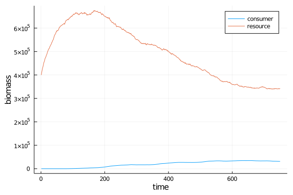

# MetacommunityDynamics.jl

A Julia library for simulating the dynamics of species interaction
networks across space and time. Part of [EcoJulia](http://github.com/EcoJulia),
and built on top of [DynamicGrids](http://github.com/cesaraustralia/DynamicGrids.jl).


This software is designed to simulate how the composition of ecological communities changes over time.


# Examples

## Lotka-Volterra 


The Lotka-Volterra (LV) system is a set of coupled differential equations
which describe a system of consumers and resources (also called predators and prey).


### Normal LV

```
using MetacommunityDynamics
using DynamicGrids
using Dispersal: OutwardsDispersal
using Distributions 
consumermodel = 
    Eating{Tuple{:C,:R}}(
        functionalresponse=LotkaVoterra(0.1), 
        dt=0.1) +
    OutwardsDispersal{:C}() + 
    LinearMortality{:C}(0.3);

resourcemodel = 
    LogisticGrowth{:R}(λ=2, K=200., dt=0.1) +
    LinearMortality{:R}(0.01) + 
    OutwardsDispersal{:R}();

model = resourcemodel + consumermodel

gridsize = 100
initconsumer = rand(Biomass, Uniform(10, 30), gridsize, gridsize)
initresource = rand(Biomass, Uniform(10, 90), gridsize, gridsize)

arrayout = ArrayOutput((C=initconsumer, R=initresource ), tspan=1:300)
sim!(arrayout, model)
```

and to plot

```
using Plots

Cs = Float64[]
Rs = Float64[]
for t in arrayout
    push!(Cs, sum(t[:C]))
    push!(Rs, sum(t[:R]))
end

plot(1:length(Cs),Cs, label="consumer")
plot!(1:length(Rs),Rs, label="resource")
xlabel!("time")
ylabel!("biomass")

```


### LV with random dispersal 

<details>

```
consumermodel = 
    Eating{Tuple{:C,:R}}(
        functionalresponse=LotkaVolterra(0.1), 
        dt=0.1) +
    AdjacentBernoulliDispersal{:C}(DispersalKernel(radius=3), 0.5) + 
    LinearMortality{:C}(0.1);

resourcemodel = 
    MetacommunityDynamics.LogisticGrowth{:R}(λ=1.4, K=200., dt=0.1) +
    AdjacentBernoulliDispersal{:R}(DispersalKernel(radius=5), 0.2) +
    LogisticGrowth{:R}(λ=2, K=200., dt=0.1);

model = resourcemodel + consumermodel

```
</details>


### LV with random dispersal and extinction

<details>

```
consumermodel = 
    Eating{Tuple{:C,:R}}(
        functionalresponse=LotkaVolterra(0.1), 
        dt=0.1) +
    AdjacentBernoulliDispersal{:C}(DispersalKernel(radius=3), 0.5) + 
    RandomExtinction{:C}(0.05) + 
    LinearMortality{:C}(0.1);

resourcemodel = 
    MetacommunityDynamics.LogisticGrowth{:R}(λ=1.4, K=200., dt=0.1) +
    AdjacentBernoulliDispersal{:R}(DispersalKernel(radius=5), 0.2) +
    RandomExtinction{:R}(0.05);

model = resourcemodel + consumermodel

gifoutput = GifOutput((C=initconsumer, R=initresource ),
    filename="out.gif", 
    tspan=1:750, 
    fps=25, 
    minval=(0,0), maxval=(3,10),
    scheme = (ColorSchemes.Blues_5, ColorSchemes.Greens_4),
    padval = 100
)
sim!(gifoutput, model)

```

</details>




## Contributing

Open a PR or issue
